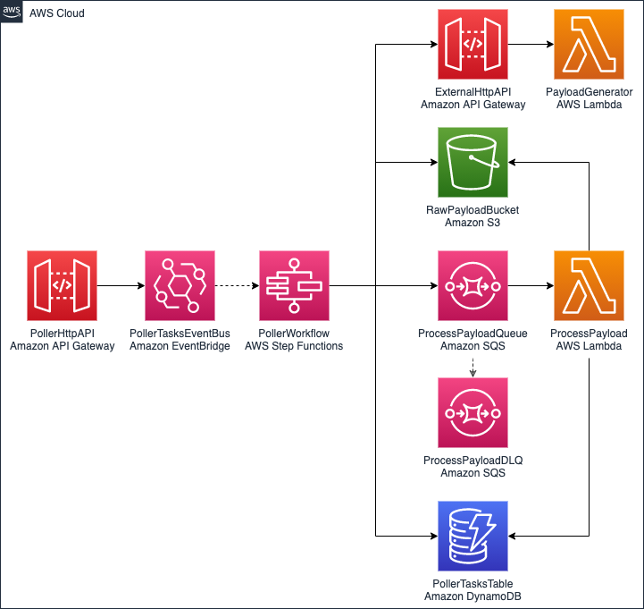
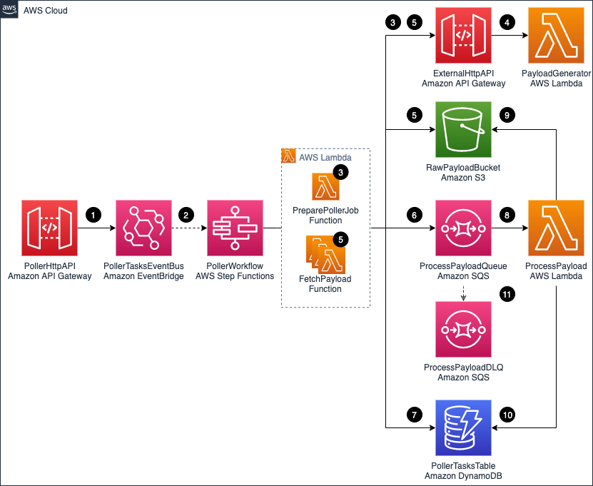
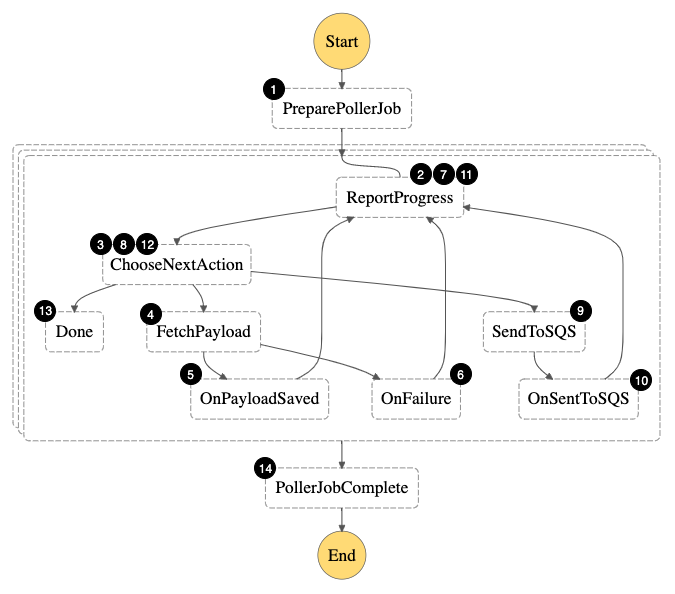
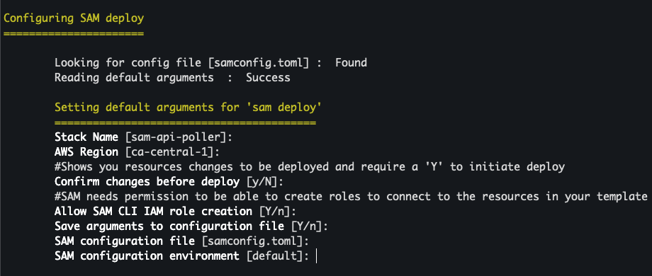
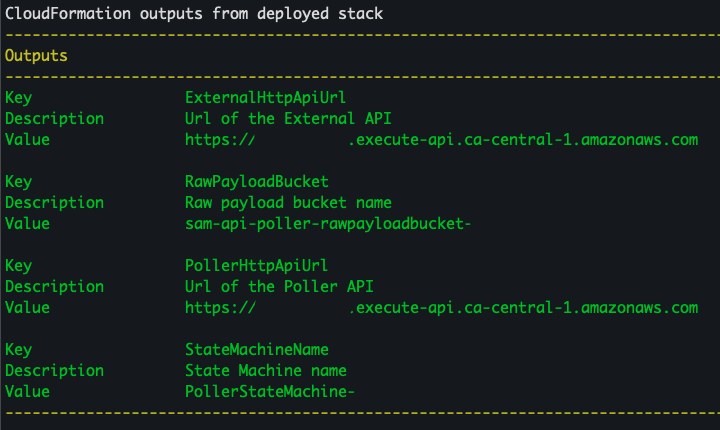
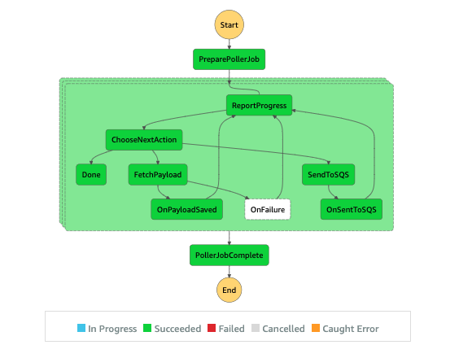
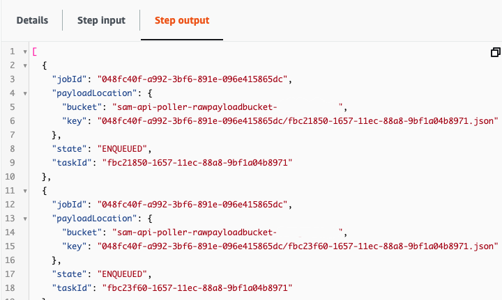

# Building an API poller with AWS Step Functions and AWS Lambda

Many customers have to integrate with external APIs. One of the most common use cases is data synchronization between a customer and their trusted partner.

There are multiple ways of doing this. For example, the customer can provide a webhook that the partner can call to notify the customer of any data changes. Often the customer has to poll the partner API to stay up to date with the changes. Even when using a webhook, a complete synchronization happening on schedule is necessary.

Furthermore, the partner API may not allow loading all the data at once. Often, a [pagination solution](https://en.wikipedia.org/wiki/Pagination) iallows loading only a portion of the data via one API call. That requires the customer to build an API poller that can iterate through all the data pages to fully synchronize.

This post demonstrates a sample API poller architecture, using [AWS Step Functions](https://aws.amazon.com/step-functions/) for orchestration, [AWS Lambda](https://aws.amazon.com/lambda/) for business logic processing, along with [Amazon API Gateway](https://aws.amazon.com/api-gateway/), [Amazon DynamoDB](https://aws.amazon.com/dynamodb/), [Amazon SQS](https://aws.amazon.com/sqs/), [Amazon EventBridge](https://aws.amazon.com/eventbridge/), [Amazon Simple Storage Service](https://aws.amazon.com/s3/) (Amazon S3), and the [AWS Serverless Application Model](https://docs.aws.amazon.com/serverless-application-model/index.html) (AWS SAM).

## Overall architecture



The application consists of the following resources defined in the AWS SAM [template](./template.yaml):

* **PollerHttpAPI**: The front door of the application represented via an API Gateway HTTP API.
* **PollerTasksEventBus**: An EventBridge event bus that is directly integrated with API Gateway. That means that an API call results in an event being created in the event bus. EventBridge allows you to route the event to the destination you want. It also allows you to [archive and replay events](https://aws.amazon.com/blogs/aws/new-archive-and-replay-events-with-amazon-eventbridge/) as needed, adding resiliency to the architecture. Each event has a unique id that this solution uses for tracing purposes.
* **PollerWorkflow**: The Step Functions workflow.
* **ExternalHttpApi**: The API Gateway HTTP API that is used to simulate an external API.
* **PayloadGenerator**: A Lambda function that is generating a sample payload for the application.
* **RawPayloadBucket** An Amazon S3 bucket that stores the payload received from the external API. The Step Functions [supported payload size](https://aws.amazon.com/about-aws/whats-new/2020/09/aws-step-functions-increases-payload-size-to-256kb/) up to `256 KB`. For larger payloads, you can store the API payload in an S3 bucket.
* **PollerTasksTable**: A DynamoDB table that tracks each poller’s progress. The table has a TimeToLive (TTL) attribute enabled. This automatically discards tasks that exceed the TTL value.
* **ProcessPayoadQueue**: Amazon SQS queue that decouples our payload fetching mechanism from our payload processing mechanism.
* **ProcessPayloadDLQ**: Amazon SQS dead letter queue is collecting the messages that we are unable to process.
* **ProcessPayload**: Lambda function that is processing the payload. The function reports progress of each poller task, marking it as complete when given payload is processed successfully.

## Data flow



When the API poller runs:

1. After a `POST` call is made to PollerHttpAPI `/jobs` endpoint, an event containing the API payload is put on the PollerTasksEventBus.
1. The event triggers the PollerWorkflow execution. The event payload (including the event unique id) is passed to the PollerWorkflow.
1. The PollerWorkflow starts by running the PreparePollerJob function. The function retrieves required metadata from the ExternalHttpAPI. For example, the total number of records to be loaded and maximum records that can be retrieved via a single API call. The function creates poller tasks that are required to fetch the data. The task calculation is based on the metadata received.
1. The PayloadGenerator function generates random ExternalHttpAPI payloads. The PayloadGenerator function also includes code that simulates random errors and delays.
1. All the tasks are processed in a fan-out fashion using [dynamic-parallelism](https://aws.amazon.com/blogs/aws/new-step-functions-support-for-dynamic-parallelism/). The FetchPayload function retrieves a payload chunk from the ExternalHttpAPI, and the payload is saved to the RawPayloadBucket.
1. A message, containing a pointer to the payload file stored in the RawPayloadBucket, the id of the task, and other task information is sent to the ProcessPayloadQueue. Each message has jobId and taskId attributes. This helps correlate the message with the poller task.
1. Anytime a task is changing its status (for example, when the payload is saved to S3 bucket, or when a message has been sent to SQS queue) the progress is reported to the PollerTaskTable.
1. The ProcessPayload function is long-polling the ProcessPayloadQueue. As messages appear on the queue, they are being processed.
1. The ProcessPayload function is removing an object from the RawPayloadBucket. This is done to illustrate a type of processing that you can do with the payload stored in the S3 bucket.
1. After the payload is removed successfully, the progress is reported to the PollerTasksTable. The corresponding task is marked as complete.
1. If the ProcessPayload function experiences errors, it tries to process the message several times. If it cannot process the message, the message is pushed to the ProcessPayloadDLQ. This is configured as a dead-letter queue for the ProcessPayloadQueue.

## Step Functions state machine



The Step Functions state machine orchestrates the following workflow:

1. Fetch external API metadata and create tasks required to fetch all payload.
1. For each task, report that the task has entered Started state.
1. Since the task is in the Started state, the next action is FetchPayload
1. Fetch payload from the external API and store it in an S3 bucket.
1. In case of success, move the task to a PayloadSaved state.
1. In case of an error, report that the task is in a failed state.
1. Report that the task has entered PayloadSaved (or failed) state.
1. In case the task is in the PayloadSaved state, move to the SendToSQS step. If the task is in a failed state, exit.
1. Send the S3 object pointer and additional task metadata to the SQS queue.
1. Move the task to an enqueued state.
1. Report that the task has entered enqueued state.
1. Since the task is in the enqueued state, we are done.
1. Combine the results for a single task execution.
1. Combine the results for all the task executions.

## Prerequisites to implement the solution

The following prerequisites are required for this walk-through:

1. An [AWS Account](https://aws.amazon.com/free/?trk=ps_a134p000003yBfsAAE&trkCampaign=acq_paid_search_brand&sc_channel=ps&sc_campaign=acquisition_US&sc_publisher=google&sc_category=core&sc_country=US&sc_geo=NAMER&sc_outcome=acq&sc_detail=%2Baws%20%2Baccount&sc_content=Account_bmm&sc_segment=438195700994&sc_medium=ACQ-P|PS-GO|Brand|Desktop|SU|AWS|Core|US|EN|Text&s_kwcid=AL!4422!3!438195700994!b!!g!!%2Baws%20%2Baccount&ef_id=Cj0KCQjwsuP5BRCoARIsAPtX_wEmxImXtbdvL3n4ntAafj32KMc_sXL9Z-o8FyXVQzPk7w__h2FMje0aAhOFEALw_wcB:G:s&s_kwcid=AL!4422!3!438195700994!b!!g!!%2Baws%20%2Baccount&all-free-tier.sort-by=item.additionalFields.SortRank&all-free-tier.sort-order=asc).
1. The [AWS SAM CLI](https://docs.aws.amazon.com/serverless-application-model/latest/developerguide/serverless-sam-cli-install.html) installed.
1. [Node.js 14](https://nodejs.org/en/download/), [npm](https://www.npmjs.com/), [Typescript](https://www.typescriptlang.org/), and [jq](https://stedolan.github.io/jq/download/) installed.

## Step-by-step instructions

You can use [AWS Cloud9](https://aws.amazon.com/cloud9/), or your preferred IDE, to deploy the AWS SAM template. Refer to the cleanup section of this post for instructions to delete the resources to stop incurring any further charges.

1. Clone the repository by running the following command:

```zsh
git clone https://github.com/aws-samples/sam-api-poller.git
```

2. Change to the `sam-api-poller` directory, install dependencies and build the application:

```zsh
npm install
sam build -c -p
```

3. Package and deploy the application to the AWS Cloud, following the series of prompts. Name the stack `sam-api-poller`:

```zsh
sam deploy --guided --capabilities CAPABILITY_NAMED_IAM
```



4. After stack creation, you see `ExternalHttpApiUrl`, `PollerHttpApiUrl`, `StateMachineName`, and `RawPayloadBucket` in the outputs section.



5. Store API urls as variables:

```zsh
POLLER_HTTP_API_URL=$(aws cloudformation describe-stacks --stack-name sam-api-poller --query "Stacks[0].Outputs[?OutputKey=='PollerHttpApiUrl'].OutputValue" --output text)
EXTERNAL_HTTP_API_URL=$(aws cloudformation describe-stacks --stack-name sam-api-poller --query "Stacks[0].Outputs[?OutputKey=='ExternalHttpApiUrl'].OutputValue" --output text)
```

6. Make an API call:

```zsh
REQUEST_PYLOAD=$(printf '{"url":"%s/payload"}' $EXTERNAL_HTTP_API_URL)
EVENT_ID=$(curl -d $REQUEST_PYLOAD -H "Content-Type: application/json" -X POST $POLLER_HTTP_API_URL/jobs | jq -r '.Entries[0].EventId')
```

7. The `EventId` that is returned by the API is stored in a variable. You can trace all the poller tasks related to this execution via the `EventId`. Run the following command to track task progress:

```zsh
curl -H "Content-Type: application/json" $POLLER_HTTP_API_URL/jobs/$EVENT_ID
```

8. Inspect the output. For example:

```json
{"Started":9,"PayloadSaved":15,"Enqueued":11,"SuccessfullyCompleted":0,"FailedToComplete":0,"Total":35}
```

9. Navigate to [Step Functions](https://console.aws.amazon.com/states/home) console and choose the state machine name that corresponds to the `StateMachineName` from the section `4`. Choose an execution and inspect the visual flow.



10. Inspect each individual step by clicking on it. For example, for the `PollerJobComplete` step, you see:



## Cleanup

1. Make sure that the `RawPayloadBucket` bucket is empty. In case the bucket has some files, follow [emptying a bucket guide](https://docs.aws.amazon.com/AmazonS3/latest/userguide/empty-bucket.html).
1. To delete all the resources permanently and stop incurring costs, navigate to the [CloudFormation](https://console.aws.amazon.com/cloudformation) console. Select the `sam-api-poller` stack, and choose **Delete** -> **Delete stack**.

## Cost optimization

For Step Functions, this example uses the Standard Workflow type because it has a visualization tool. If you are planning to re-use the solution, consider [switching from standard to Express Workflows](https://docs.aws.amazon.com/step-functions/latest/dg/concepts-standard-vs-express.html). This may be a better option for the type of workload in this example.

## Conclusion

This post shows how to use Step Functions, Lambda, EventBridge, S3, API Gateway HTTP APIs, and Amazon SQS to build a serverless API poller. I show how you can deploy a sample solution, process sample payload, and store it to S3.

I also show how to perform clean-up to avoid any additional charges. You can modify this example for your needs and build a custom solution for your use case.

For more serverless learning resources, visit [Serverless Land](https://serverlessland.com/).

## References

* AWS SAM CLI: [Using TypeScript with nodejs runtime](https://github.com/aws/aws-sam-cli/issues/2636)
* [Example project for developing AWS Lambda functions on TypeScript](https://github.com/Envek/aws-sam-typescript-layers-example)

## Security

See [CONTRIBUTING](CONTRIBUTING.md#security-issue-notifications) for more information.

## License

This library is licensed under the MIT-0 License. See the LICENSE file.
